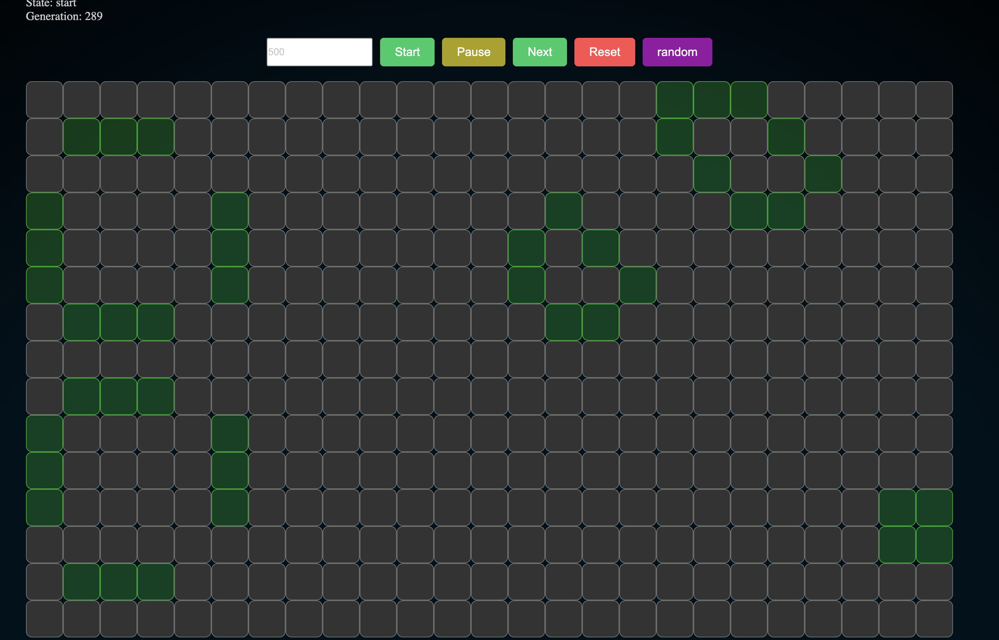

## Conway's Game of Life - Angular Project

### Description

This project is an Angular implementation of Conway's Game of Life. It uses a grid of cells, where each cell can be either "alive" or "dead." The game follows simple rules to simulate the evolution of cells across generations.

### Features

- A grid where you can toggle the state of each cell.
- Start and pause the game to see the evolution of cells based on Conway's rules.
- Step through generations manually using the "Next Step" button.
- random or reset state any any point in time.
- set custom speed for next generations.

### Conway's Game of Life Rules

1. Any live cell with two or three live neighbors survives.
2. Any dead cell with three live neighbors becomes a live cell.
3. All other live cells die in the next generation. Similarly, all other dead cells stay dead.

### Installation and Setup

To get started with the project, follow the steps below:

1. **Clone the Repository:**
   ```bash
   git clone <repository-url>
   cd <repository-name>
   ```

2. **Install Dependencies:**
   Run the following command in the project directory:
   ```bash
   npm install
   ```

3. **Run the Application:**
   After installing the dependencies, start the application by running:
   ```bash
   ng serve
   ```
   Navigate to `http://localhost:4200/` in your browser to see the game in action.

### Components

- **`AppComponent`**: This is the main entry point of the application.
- **`GameOfLifeComponent`**: The core component responsible for rendering the grid and controlling the simulation.

### How to Play

1. Open the application in your browser.
2. Click on any cell to toggle between the "alive" and "dead" states.
3. Use the buttons above the grid to start, pause, or step through generations:
   - **Start**: Automatically progresses the simulation every second.
   - **Pause**: Stops the automatic progression.
   - **Next Step**: Manually advances the simulation by one generation.
   - **Reset**: Cleans up current game, time and tiles.
   - **Random**: Generate random dead or alive tiles.

### Technologies Used

- **Angular**: Frontend framework
- **RxJS**: Used to handle intervals and reactive programming
- **TypeScript**: Language for Angular development
- **SCSS**: Styling for the grid and cells

### Project Structure

```plaintext
src/
├── app/
│   ├── game-of-life/
│   │   ├── game-of-life.component.ts
│   │   ├── game-of-life.component.html
│   │   ├── game-of-life.component.scss
│   ├── app.component.ts
│   ├── app.component.html
│   ├── app.component.scss
│   └── app.module.ts
├── assets/
├── environments/
├── main.ts
├── polyfills.ts
└── styles.Scss
```

### Future Enhancements

- Add the ability to change grid size dynamically.
- Implement different known patterns (e.g., gliders, oscillators) to seed the grid.

### License

This project is licensed under the MIT License. See the `LICENSE` file for more details.

### Acknowledgements

This project is inspired by John Conway's Game of Life. Special thanks to the open-source community for the tools and libraries used in this project.


